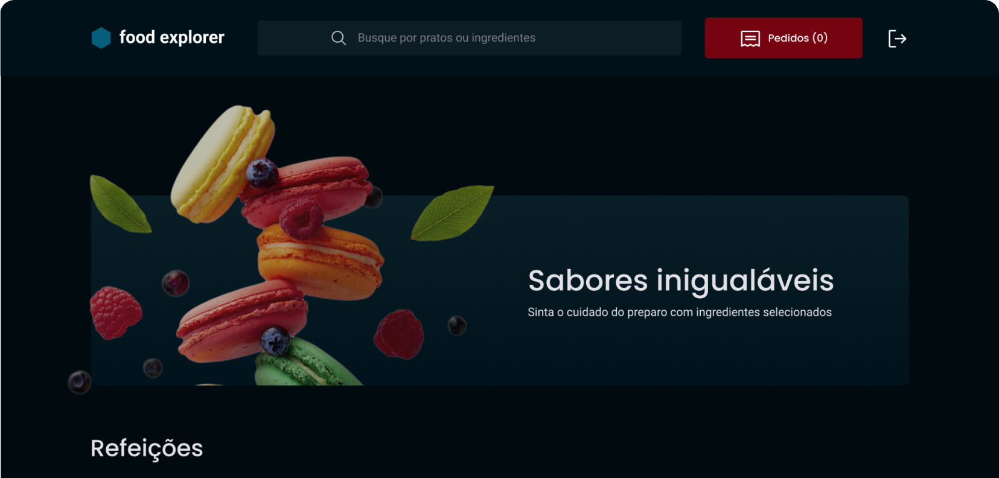
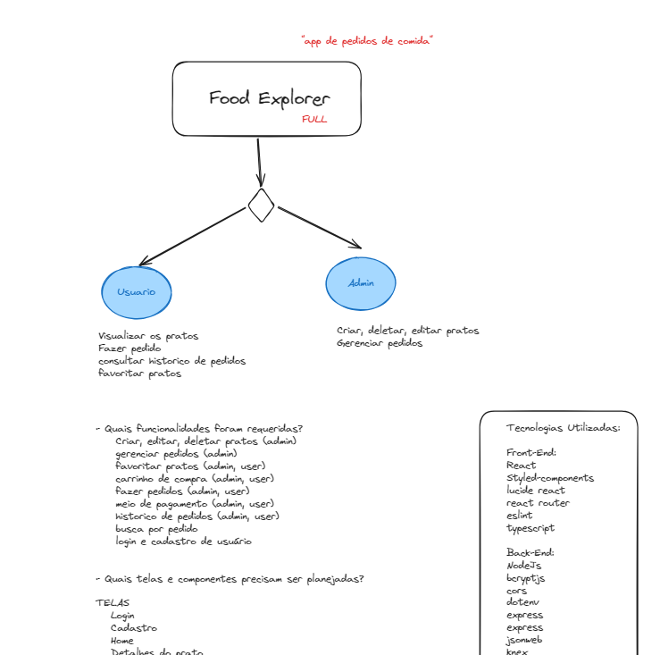
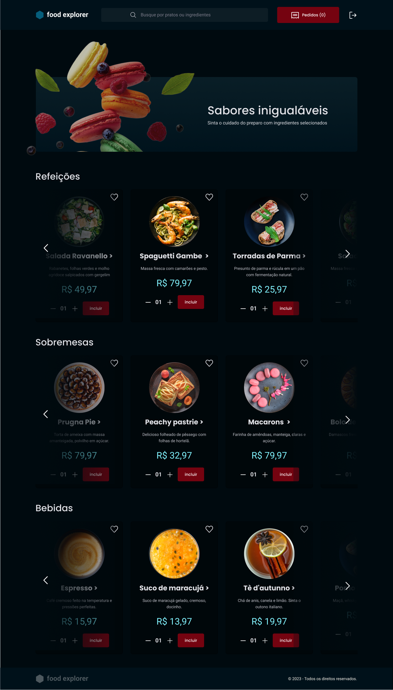

Status: Em Andamento 🚧

## Food Explorer

Food Explorer, um menu interativo para um restaurante fictício. Este projeto envolve a criação de uma aplicação completa, abrangendo tanto o front-end quanto o back-end, utilizando as tecnologias aprendidas durante nossa jornada no Explorer.

O Food Explorer é concebido para simular a experiência de um restaurante, com base no layout cuidadosamente projetado disponibilizado no Figma. Este layout abrange desde a visualização de pratos até o processo de pagamento, inclusive uma versão mobile do projeto para uma experiência completa em qualquer dispositivo.

Este aplicativo terá dois principais usuários, cada um com seu papel definido:

Admin: O administrador é a pessoa responsável pelo restaurante. Ele terá o poder de criar, visualizar, editar e excluir pratos a qualquer momento. Cada prato deve ser composto por uma imagem, um nome, uma categoria, uma breve descrição, os ingredientes e o preço. Quando o admin adicionar um prato, receberá uma mensagem de sucesso e será redirecionado para a página principal.

 

Usuário: Os usuários do Food Explorer poderão visualizar todos os pratos cadastrados no restaurante. Ao clicar em um prato, serão direcionados para uma nova tela com informações detalhadas sobre ele, podendo adicionar os pratos ao carrinho e realizar a compra dos pratos selecionados.

## Funcionalidades:

- Criação de usuário
- Atualização de usuário
- Autenticação de usuário (Token JWT)
- Criar, deletar e editar pratos (Admin)
- Gerenciamento de pedidos (Admin)
- Histórico de pedidos 
- Favoritar pratos
- Listagem de pratos
- Fazer pedidos 
- Busca por pedido
- Carrinho de compra
- Meio de pagamento

## Back-End

<a href="#">Acesse</a>

## Front-End

<a href="#">Acesse</a>

## Demonstração:

